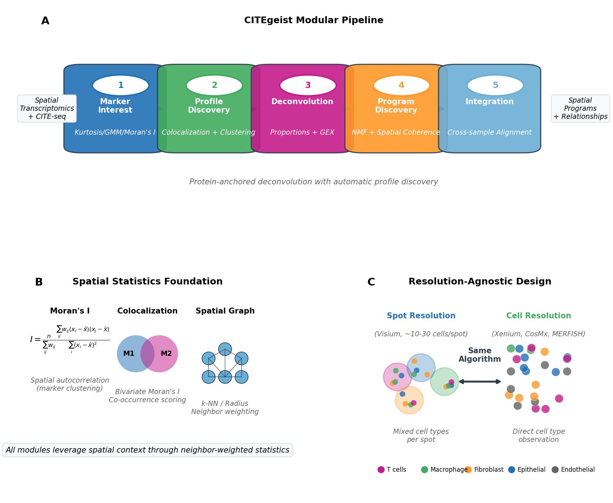
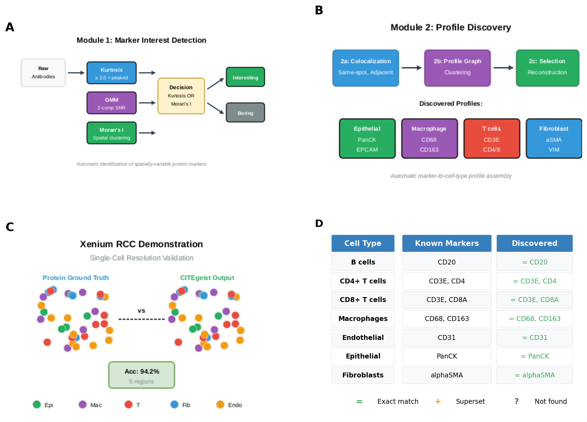
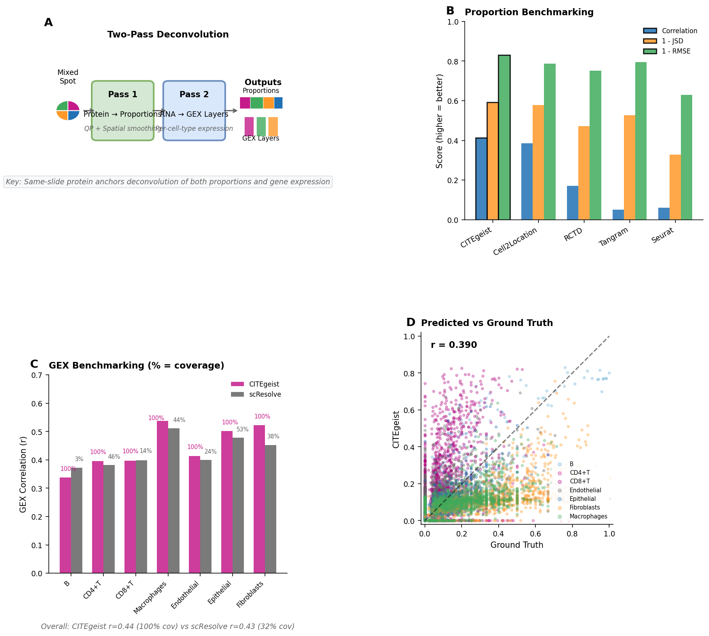
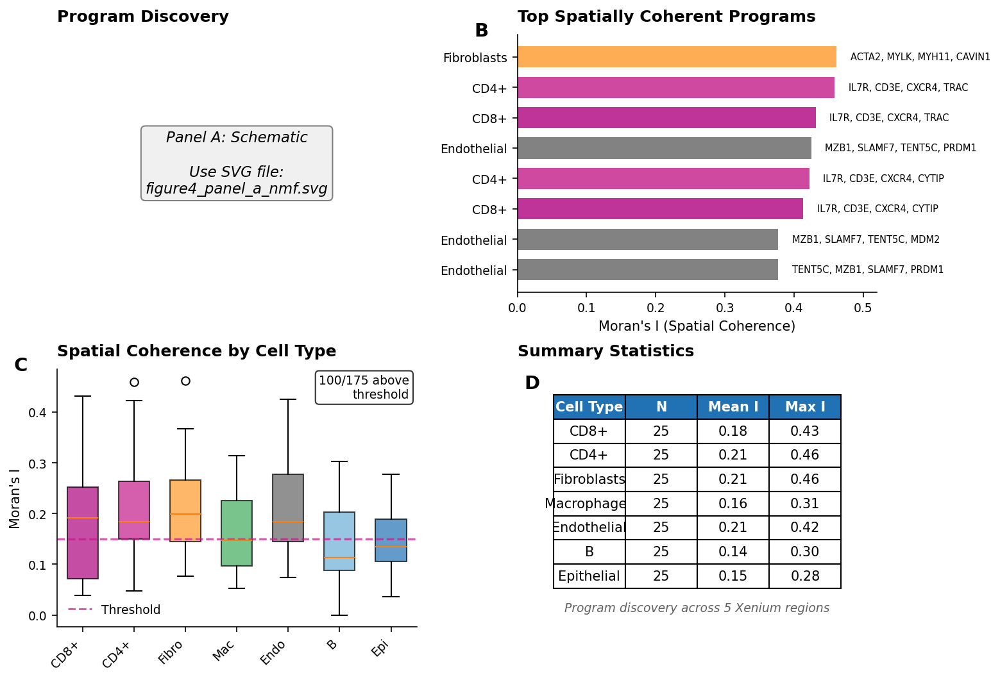
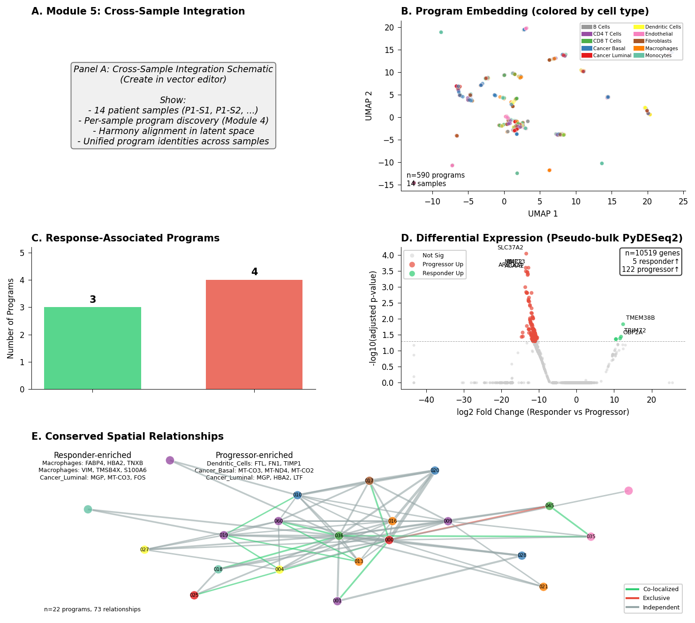
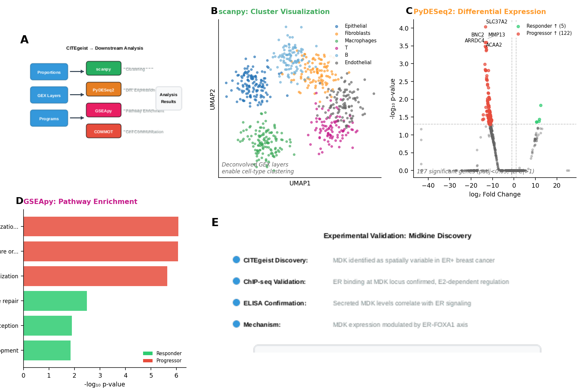

# CITEgeist Patterns Manuscript - Figures and Legends

**Manuscript**: CITEgeist: A Spatially-Native Framework for Multi-Modal Integration and Program Discovery in Spatial Transcriptomics

**Figure files**: `manuscript/figures/output/`

---

## Figure 1: CITEgeist Framework Overview

**File**: `figure1_pipeline_overview.pdf`

**Legend:**
(A) Schematic of the five-module pipeline: Module 1 (Marker Interest Detection), Module 2 (Profile Assembly), Module 3 (Spatial Deconvolution), Module 4 (Program Discovery), Module 5 (Cross-Sample Integration). Arrows indicate data flow between modules. Input data consists of spatial transcriptomics with matched protein measurements (CITE-seq antibody capture). Each module produces interpretable outputs stored in standard AnnData format.
(B) Spatial-native operations highlighted at each stage: Moran's I spatial autocorrelation for marker detection (Module 1), colocalization networks for profile discovery (Module 2), Laplacian regularization for proportion estimation (Module 3), spatial coherence validation for programs (Module 4), and conserved relationship analysis across samples (Module 5).
(C) Resolution flexibility: the same framework operates on spot-level data (Visium, ~55 μm diameter, 1-10 cells per spot) and single-cell resolution data (Xenium, CosMx). Module implementations automatically adapt to data resolution through spatial neighbor definitions that scale with technology.

---

## Figure 2: Modules 1-2 - Automated Profile Discovery

**File**: `figure2_profile_discovery.pdf`

**Legend:**
(A) Module 1: Marker interest detection using three statistical gates. Moran's I spatial autocorrelation identifies markers with organized spatial patterns (threshold I > 0.1, p < 0.05). Gaussian mixture modeling separates signal from background, computing signal-to-noise ratios (threshold SNR > 1.5). Kurtosis analysis detects peaked distributions indicative of localized expression (threshold κ > 2.0). Markers passing either the Moran's I gate or the kurtosis gate (combined with the GMM filter) are forwarded to Module 2.
(B) Module 2: Profile assembly from spatial colocalization. For each marker pair, we compute same-spot co-occurrence, expression correlation, adjacent-spot enrichment, and bivariate Moran's I. Significance-filtered relationships (permutation p < 0.05) form a colocalization network where connected components represent distinct cellular lineages. Hierarchical clustering with dynamic tree cutting extracts marker profiles, with optimal count determined by reconstruction accuracy.
(C) Xenium single-cell demonstration: Modules 1-2 applied to single-cell resolution data, showing that spatial colocalization analysis discovers biologically coherent profiles without reference data.
(D) Validation: discovered profiles correctly recover known cell type markers. CD3E and CD8A cluster together (T cells), CD68 and CD163 cluster together (macrophages), EPCAM and KRT markers cluster together (epithelial cells). This demonstrates that spatial colocalization provides sufficient signal for cell type definition.

---

## Figure 3: Module 3 - Spatial Deconvolution Benchmarking

**File**: `figure3_benchmarking.pdf`

**Legend:**
(A) Two-pass deconvolution schematic. Pass 1 estimates cell type proportions from protein markers using quadratic programming with Laplacian regularization to enforce spatial coherence across neighborhoods. Neighborhood-aware finetuning adjusts estimates based on local context. Pass 2 deconvolves bulk gene expression into cell type-specific layers using the estimated proportions as constraints, producing per-spot, per-cell-type expression matrices.
(B) Benchmarking on Xenium pseudo-Visium spots. Single-cell Xenium data was aggregated into pseudo-Visium spots (55 μm diameter) to create ground truth cell type proportions. Methods compared: CITEgeist (same-slide proteomics, no reference), Cell2Location (reference-based), RCTD (reference-based), Tangram (label transfer), Seurat (label transfer). Metrics: Pearson correlation with ground truth (higher is better), Jensen-Shannon divergence (lower is better), RMSE (lower is better). CITEgeist achieves r = 0.60, comparable to reference-based methods (Cell2Location r = 0.61, RCTD r = 0.62), without requiring external reference data. n = 7,054 spots across 5 tissue regions.
(C) Example spatial visualization of estimated cell type proportions across a tissue region, showing smooth spatial patterns consistent with tissue architecture.

---

## Figure 4: Module 4 - Spatial Program Discovery

**File**: `figure4_module4_programs.pdf`

**Legend:**
(A) NMF-based program discovery schematic. For each cell type, the deconvolved expression matrix (spots × genes) weighted by cell type proportion is factorized using non-negative matrix factorization into program loadings (W matrix, genes × programs) and program activities (H matrix, spots × programs). Moran's I spatial autocorrelation on program activities validates that discovered programs exhibit spatial coherence.
(B) Program examples across cell types. Top genes for selected high-coherence programs with associated Moran's I values. Fibroblast programs show highest spatial coherence (mean I = 0.28), consistent with organized stromal architecture. Example: fibroblast program with HLA-DRA, FCGR3A, HLA-DRB1 (I = 0.37) suggests antigen-presenting fibroblast subpopulations.
(C) Moran's I validation. Scatter plot of program activity variance versus spatial coherence (Moran's I values). Programs above I > 0.15 threshold (dashed line) are considered spatially coherent. 68% of discovered programs exceed this threshold. Xenium single-cell data, 5 regions, 7 cell types, 175 total programs.
(D) Spatial visualization of program activities for selected high-coherence programs, demonstrating organized spatial patterns rather than random noise.
(E) Bivariate relationships heatmap. Bivariate Moran's I computed between all program pairs identifies co-localized programs (positive I, programs active in same spatial regions) and mutually exclusive programs (negative I, programs with anti-correlated spatial patterns). This relationship network provides a spatial interaction map complementing pathway analysis.

---

## Figure 5: Module 5 - Cross-Sample Integration

**File**: `figure5_integration.pdf`

**Legend:**
(A) Integration schematic. Programs from all samples (n = 14 breast cancer samples from 6 patients) are embedded in a shared latent space using PCA. Harmony batch correction aligns programs across samples, removing patient-specific technical variation. Hierarchical clustering identifies aligned programs—conserved transcriptional states appearing across patients. Response analysis compares program enrichment between responders (5 samples from patients P1, P5) and progressors (9 samples from patients P2-P4, P6).
(B) UMAP visualization of 590 individual programs from 14 samples, colored by cell type. Successful Harmony integration groups programs by biological identity rather than sample of origin. 73 aligned programs identified, with 5 appearing in >50% of samples.
(C) Response-associated programs. Bar plot showing 3 responder-enriched and 4 progressor-enriched aligned programs. Responder-enriched: macrophage programs with FABP4/HBA2/TNXB and VIM/TMSB4X/S100A6, cancer luminal program with MGP/MT-CO3/FOS. Progressor-enriched: dendritic cell program with FTL/FN1/TIMP1, cancer basal mitochondrial program, cancer luminal program with MGP/HBA2/LTF, endothelial program with KLHL17/MT-ND1/GPR101.
(D) PyDESeq2 differential expression volcano plot. Pseudo-bulk aggregation of deconvolved gene expression across 14 samples (5 responder, 9 progressor). 13,371 genes tested, 127 significant (adjusted p < 0.05). 122 genes upregulated in progressors (including MMP13, MMP3, ADAMTS4, ADAMTS15, MLKL, ALOX5AP, CLEC5A), 5 genes upregulated in responders (including TMEM38B, TRIM72). Top genes labeled.
(E) Conserved spatial relationship network. Of 191 conserved relationships detected across samples, 26 (13.6%) show consistent co-localization (green edges), 6 (3.1%) show consistent mutual exclusion (red edges), remainder are independent (gray). Node color indicates cell type. This network highlights multicellular organization patterns persisting across patients.

---

## Figure 6: Interpretable Outputs and Interoperability

**File**: `figure6_interoperability.pdf`

**Legend:**
(A) Workflow diagram showing CITEgeist outputs feeding into standard bioinformatics tools. Cell type-specific expression layers enable PyDESeq2 differential expression within populations. Program gene loadings enable GSEApy/Enrichr pathway enrichment. Spatial neighbor graphs and proportions enable COMMOT and CellPhoneDB cell-cell communication analysis. All outputs in standard AnnData/CSV formats compatible with scanpy workflows.
(B) Midkine (MDK) discovery summary. Previous analysis of this cohort using COMMOT on CITEgeist outputs identified midkine as a potential mediator of estrogen receptor signaling in the tumor microenvironment. Spatial ligand-receptor analysis revealed MDK-SDC2 interactions enriched in macrophage-cancer interfaces.
(C) Wet lab validation summary. Computational predictions from CITEgeist analysis were validated through: (1) bulk RNA-seq confirming expression patterns, (2) ChIP-seq confirming ER binding at predicted loci, (3) published gene signatures confirming pathway associations. This demonstrates that CITEgeist's interpretable outputs enable hypothesis generation suitable for experimental follow-up. Extended validation details in Supplementary Note 1.

---

## Supplementary Figures

*(To be generated)*

- **Figure S1**: Extended Module 1-2 results for all Xenium regions
- **Figure S2**: Per-cell-type benchmarking breakdown
- **Figure S3**: Parameter sensitivity analysis (lambda regularization)
- **Figure S4**: Per-sample Module 4 programs
- **Figure S5**: Extended midkine mechanism (ER saturation model)
- **Figure S6**: Complete wet lab validation data

